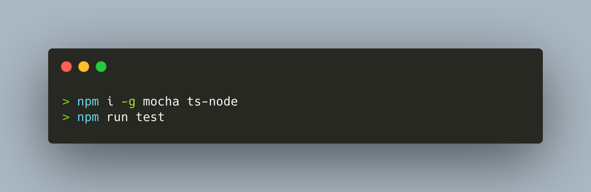

# express-ts-starter
Created for having an even smaller amount of time spent in creating the boilerplate to do the job for a basic express server with typescript support.

## Project structure
The project is structured as follows:
```
express-ts-starter
├── README.md
├── node_modules
├── package.json
├── tsconfig.json
├── tslint.json
├── .env
├── .mocharc
├── .eslintrc
├── .gitignore
├── .github
├── src
│   ├── resources
|   │   ├── ...
│   ├── routes
|   │   ├── index.ts
|   │   ├── RootEndpoint.ts
|   ├── shared
|   │   ├── Logger.ts
|   │   ├── TestClass.ts
|   ├── app.ts
│   └── Server.ts
└── test
    ├── e2e
    └── unit
|   │   ├── TestClass.spec.ts
└── utils
│   ├── copyAssets.ts
```

## Quick overview
Creates a boilerplate for an express-based server with typescript support. The application comprises the following ready-to-use modules:

### Ready-to-dist assets/resource folder
Simply create an folder named `src/resources` and pack all your resources/assets inside of it. The existing build scripts will automatically copy them into the dist folder when running `npm run build` to build the application.

### Ready-to-transpile express setup
A basic express app server, written in TypeScript, using a reusable, easy-to-maintain and extensible routing principle for clean and easy-to-use API endpoints (`src/routes`). Transpile it via `npm run build` or directly serve it with hot-reload functionality via `npm run serve`.

### Convenient usage of global project properties with zero module imports
Simply add your environment variables in `.env` and the included `dotenv` module will mount them into the app on start. You can access them from anywhere using `process.env.<your-prop-name>`.

### Custom logger with integrated tracing
Includes logging and tracing middleware from the beginning for each request to the app instance. Provides a trackingId for better traceability and logging experience. Just add a log, e.g. via logger.info('Some message') and let the logger/tracer do the rest.

### Unit testing via mocha/chai
Full TypeScript support for unit tests using `Mocha` as testing foundation and `Chai` assertion. There is a example unit test in `test/unit/TestClass.spec.ts`. You can simply run the tests via `npm run test`. Be aware that since `ts-node` and `ts-config` are required for registering the test modules in mocharc, you must ensure that the respective node packages are installed globally on your machine:
